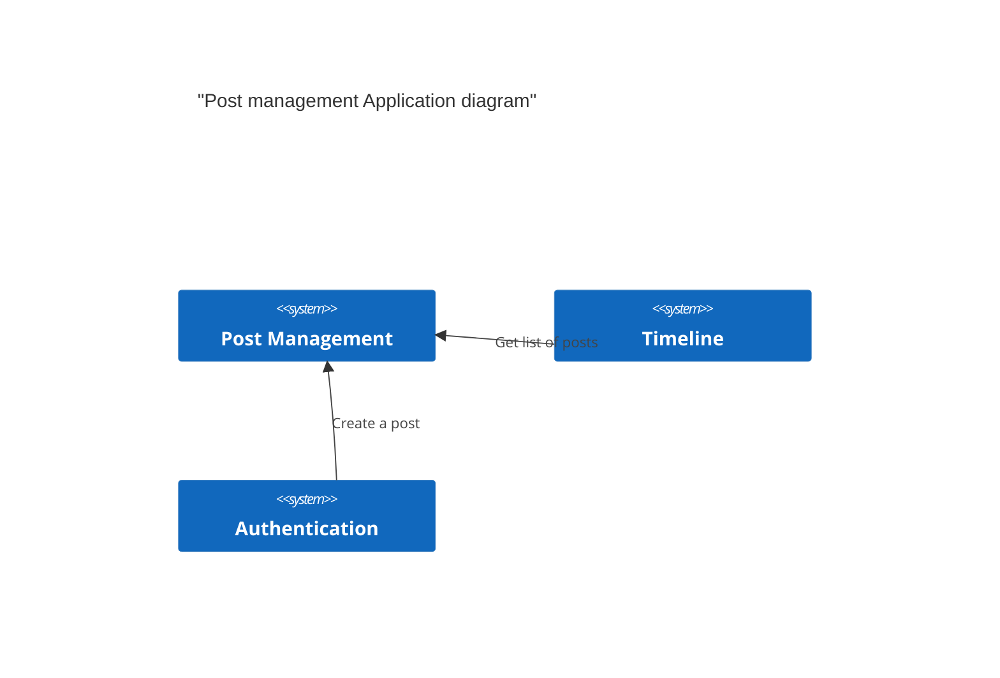
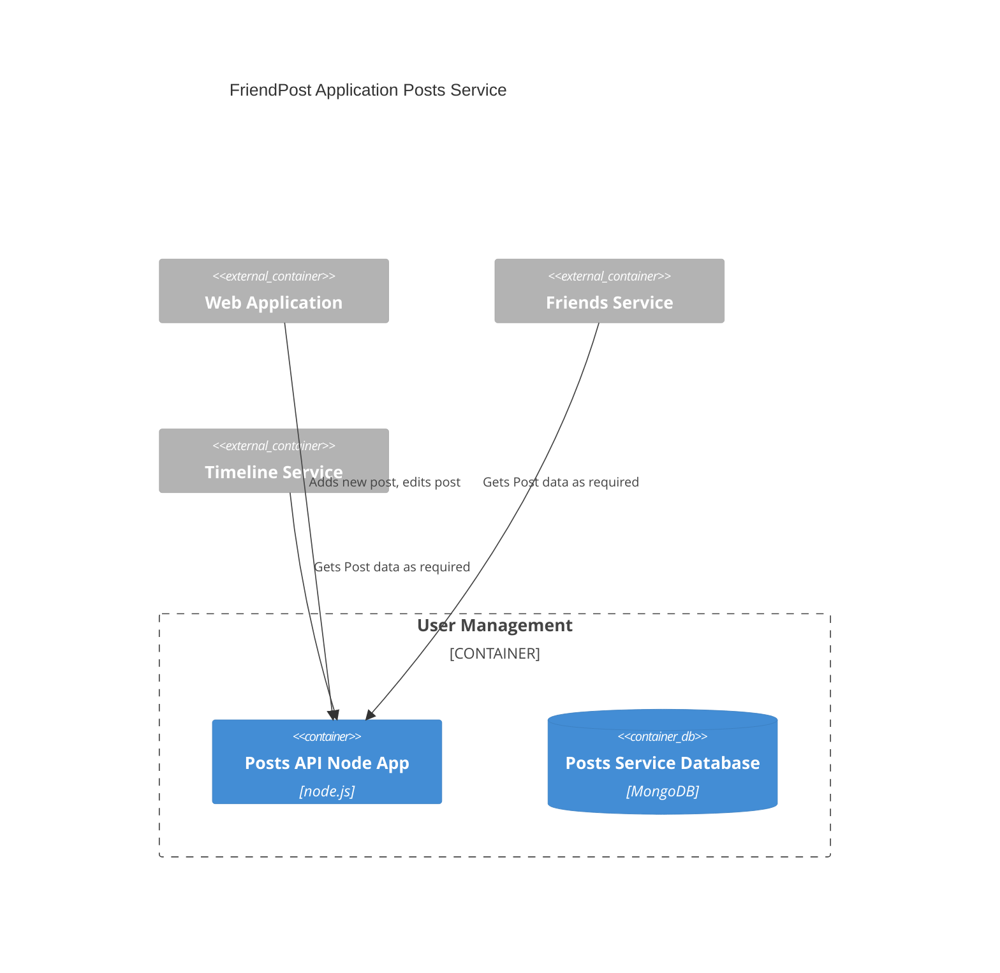

**POST Management**
This repository is for the Post service of the FriendPost Application

## C4 Context Diagram

## Tech Stack

The Posts Service will be implemented using the MERN stack.

## C4 Container Diagram

